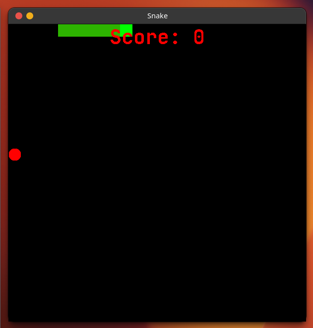
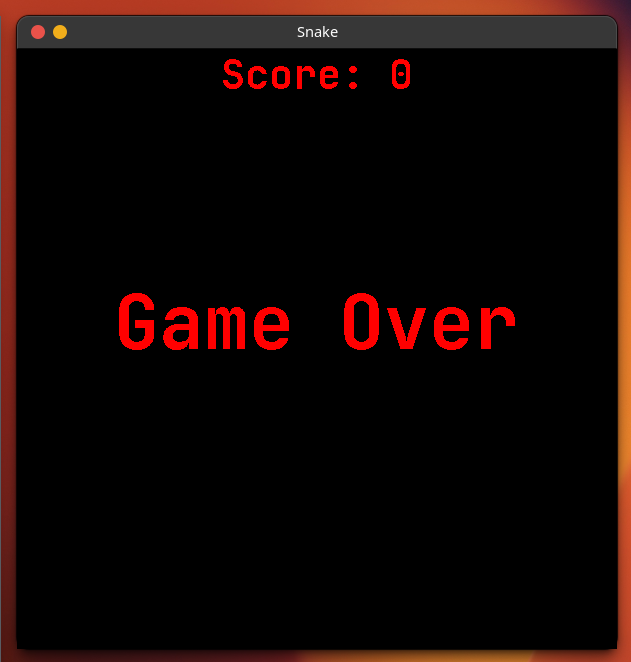

## Snake Game
>This is a very simple desktop Snake game made with Java and javax swing graphics API

  
  

### Getting Started

> To get this working on your machine
#### NOTE: 
>This is not an installation binary therefore you cannot install it as a desktop application

- clone the repo `https://github.com/victorchiaka/Snake-Game`
- open in your favourite Java - supported IDE
- ##### on terminal run
  - `java src/SnakeGame.java`
- ##### else
  - `click the run button on your IDE`

> Happy gaming (: